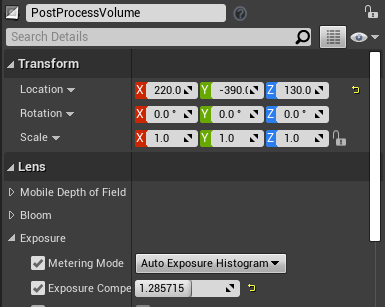

# F20GA_Coursework
## Animation

I exported the models from Maya as fbx

I imported the fbx into unreal and the materials didn't work

I then got list of working materials from https://docs.unrealengine.com/4.27/en-US/WorkingWithContent/Importing/FBX/Materials/ and replaced them in maya and reexported  and imported the models again

I added a spot light at the lamp and a directional light at window for the lighting

I then animated the filing cabinet in maya using keyframes and reexported and import it again

I then added a cinecamera to the scene in Unreal and used a level sequencer and used keyframes to move camera and turn lamp off and then added the animation from maya to the sequence

I then tested and found it was too dark so I added a post process volume to make the lighting darker by adjusting the exposure

I then rendered the video from the sequencer

